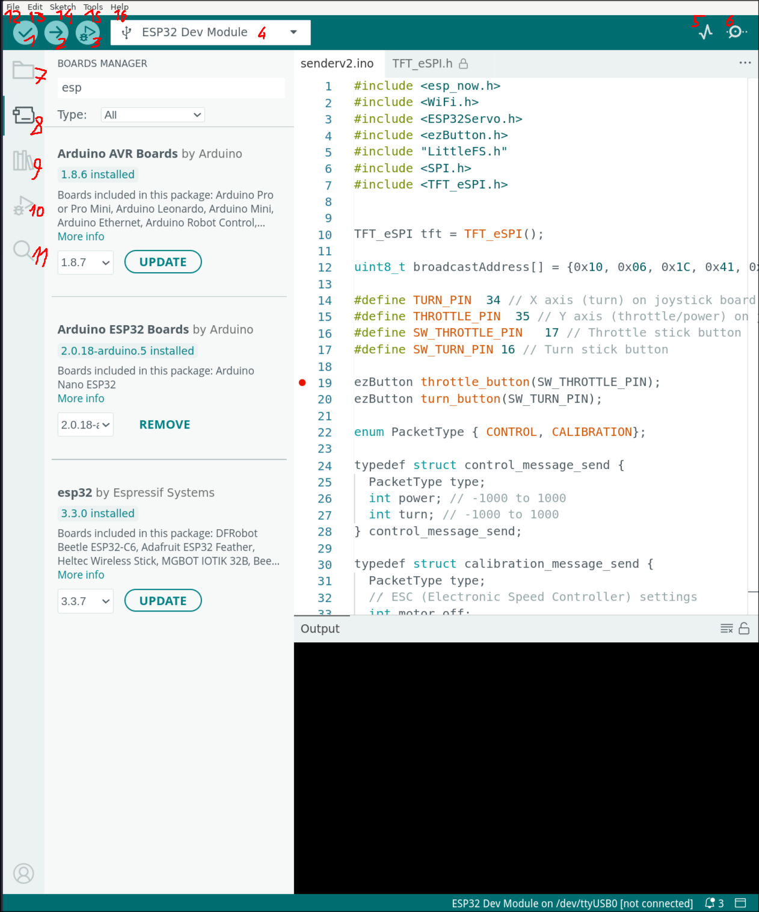
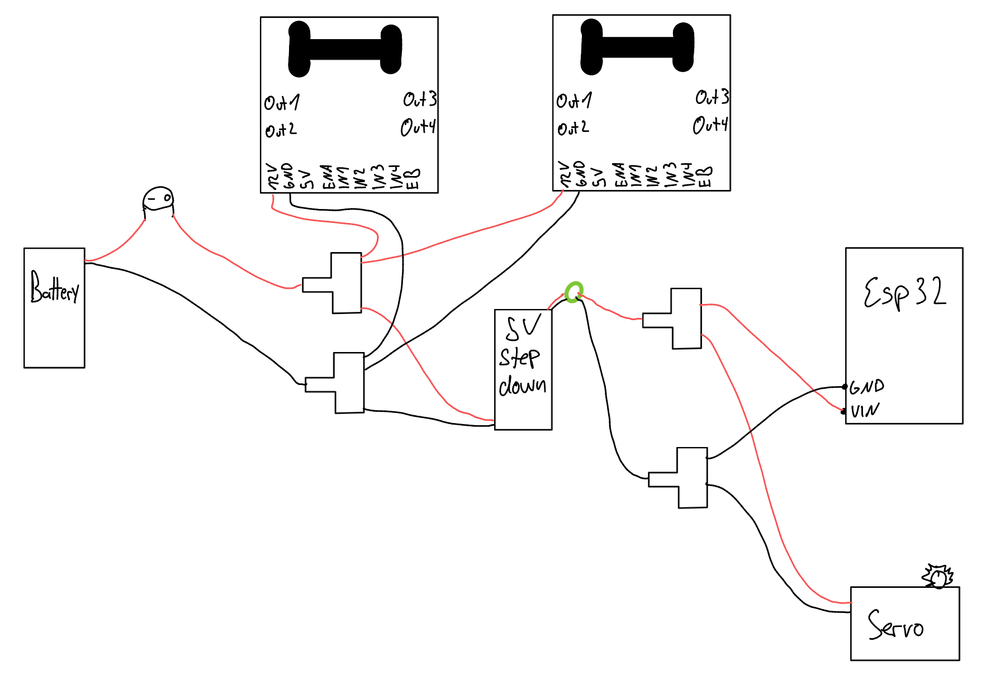
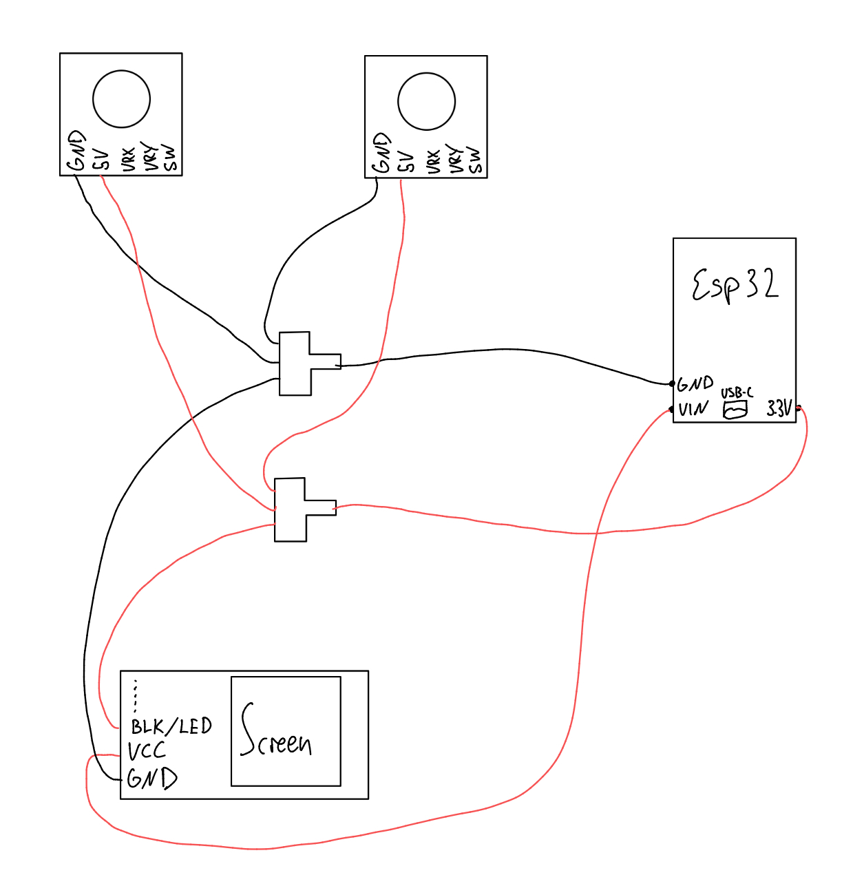

# Motorboot

# Setting Up Arduino IDE and the Required Libraries

If you need a quick rundown of the UI, click [here](#arduino-ui-rundown).

In the following sections, I will always refer to the driver versions I have installed and tested.

## Installation

[this](https://support.arduino.cc/hc/en-us/articles/360019833020-Download-and-install-Arduino-IDE)

## Board Manager

You can find these in your sidebar

- esp32 by Espressif Systems 3.3.0

## Libraries

You can find these in your sidebar

- TFT_eSPI by Bodmer 2.5.43
- ESP32Servo by Kevin Harrington 3.0.9
- ezButton by ArduinoGetStarted 1.0.6
- RC_ESC by Eric Nantel 1.1.0 (only if using the Propeller)

## Configuring TFT_eSPI

This library is a bit unusual. Go to `Arduino/libraries/TFT_eSPI`, where you will find `User_Setup.h`. There, you need to set specific parameters for the screen. You can find my configuration [here](TFT_eSPI/User_Setup.h).

## Testing and Finding MAC Address

Before assembling anything, the best way to test your Board Manager setup is by running a basic program. Since we need the MAC addresses of both boards anyway, try flashing this code [here](readMacAdress/readMacAdress.ino).

# Arduino UI Rundown

IF YOU KNOW HOW ARDUINO WORKS AND HOW TO FLASH CODE, YOU CAN SKIP THIS.

1. Compiles the code
2. Compiles and flashes the code to the board selected in 4.
3. Runs the debugger. I have never used it, but I probably should.
4. Selects the board. Click it, then click "Select other board and port...". If no port is discovered, either the cable does not support data, or Arduino does not have permission to access peripherals. Otherwise, select the board used, in our case "ESP32 Dev Module".
5. idk
6. This is the Serial Monitor. It is basically the standard output you are used to from other languages. Make sure the baud rate is the same as specified in the code `Serial.begin(115200)`, so in our case it is 115200. The baud rate specifies how many times a signal changes per second between sender and receiver.
7. This contains all your "sketches", which are just folders in your main Arduino folder.
8. Here you can install Board Managers. By default, Arduino IDE supports only Arduino microcontrollers. These are essentially packages that contain all pin mappings, clock speed, and other hardware-related information, as well as the specific compiler and uploader needed for your code to work.
9. Here you can install additional libraries. Some are already Arduino Core utilities, like `LittleFS.h` or `WiFi.h`. If a needed library is niche and not officially uploaded, it is also possible to download it from GitHub, navigate to your `Arduino/libraries` folder, put it there, and import it like any normal header file with `#include "something.h"`.
10. Debugger. I have never used it, but I probably should.
11. Sketch-wide search and replace. Since this is a VS Code fork, you might be familiar with it.
12. Preferred way to create new projects. There is also an incredible amount of sample code and examples. Most libraries you download also include examples. It is a great source to start from.
13. If you cannot use your keyboard.
14. I do not know why this exists.
15. Useful lower-level hardware specifications. Not really needed for this project except for (2.). The most practical settings are probably the following:
    1. Partition Scheme: the memory allocated to the filesystem, the app itself (binary, stack, heap), or space for over-the-air updates. Depending on the specific project, this might be worth thinking about.
    2. Erase All Flash before Sketch upload: important when you save things to your filesystem and want to preserve it when reflashing the ESP. In our case, the calibration should be preserved.
    3. PSRAM: stands for pseudo-static RAM, which is external RAM mapped to the program's address space and communicated to the CPU through an SPI bus. It is much slower but needed in certain situations (audio buffer, camera buffer, large JSON).
16. If this does not help much, this is a great source: https://randomnerdtutorials.com/. You can also use the examples in the editor under "File".

# THE BOAT

We will build and test the controller and the boat separately.

General Security Stuff

- Before powering on the boat, make sure the motors are always stabilized.
- If you are unsure what to do, always unplug the controller. The boat is programmed so that if it does not receive new packets for 4 seconds, the motors stop.

Quick Rundown of What We Will Do

- Get MAC addresses of both ESPs (maybe label them).
- Put the MAC address of the other ESP into the code.
- Flash to test the network protocol.
- Assemble ONLY the electronics of the boat and controller.
- Tape, or otherwise secure, the motors to the table and test functionality.
  - throttle and turn
  - calibrate controller and boat
- (If you want to reset calibration, just reflash and, under Tools, erase flash memory.)
- Assemble the electronics into their respective hull, shell, case, whatever.

## MAC Address Configuration

The network protocol we are using broadcasts packets, so we need to specify the receiver.
Flash [this](readMacAdress/readMacAdress.ino) code on both ESPs.

Decide which one is the boat ESP and which one is the controller.
[This] is for the controller and [this] is for the boat ESP, this is where you specify the receiver.

An example output would be `[DEFAULT] ESP32 Board MAC Address: b4:e6:2d:a9:ff:fd`
In the code meant for the other ESP, find `uint8_t broadcastAddress[]` and insert the respective MAC address, for example `uint8_t broadcastAddress[] = {0xB4, 0xE6, 0x2D, 0xA9, 0xFF, 0xFD}`.

Do that for both ESPs.

Now flash the code on both ESPs and read the serial output.

## Boat Electronics

Servo
- GPIO 13

Motor1
- ENA - GPIO 14
- IN1 - GPIO 27
- IN2 - GPIO 26

Motor2
- ENB - GPIO 25
- IN3 - GPIO 33
- IN4 - GPIO 32

The sketch only shows the "power pins", the remaining pins can be connected as specified above.

I would have created these sketches digitally in Fritzing, but it did not include all my parts, so this is what you'll have to live with.

## Controller Electronics

Left Joystick (Throttle)
- VRy - GPIO35
- SW - GPIO17
- GND - GND
- 5V+ - 3.3V

Right Joystick (Turn)
- VRx - GPIO34
- SW - GPIO16
- GND - GND
- 5V+ - 3.3V

Display
- GND - GND
- VCC - VIN
- SCL / SCK - GPIO14
- SDA -  GPIO13
- RES / RESET - GPIO33
- DC / A0 - GPIO32
- CS - GPIO15
- BLK / LED - 3.3V

The sketch only shows the "power pins", the remaining pins can be connected as specified above.

I would have created these sketches digitally in Fritzing, but it did not include all my parts, so this is what you'll have to live with.

## Testing Electronics

When testing the electronics, only test them when the motors are stabilized and no one is too close.

Use tape or the clamps from the laser cutter room to secure components.

Here you can test the [Controls](#controls) to see if everything is working as intended.

Some remarks

- The two propellers are asymmetric and counter-rotating by design: one spins clockwise, the other counter-clockwise when moving forward. This cancels out the torque reaction that would otherwise cause the boat to yaw to one side. To make one spin the other direction by default, you can swap the two wires from the motor to the motor controller.

## Controls

The left joystick is used as the throttle stick by moving it up and down.

The right joystick is used for turning by moving it left and right.

By holding the throttle stick, you enter boat calibration. You can cancel it by holding the turn stick.

By holding the turn stick, you enter controller calibration. You can cancel it by holding the throttle stick.
