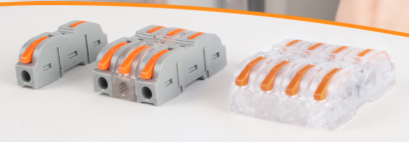
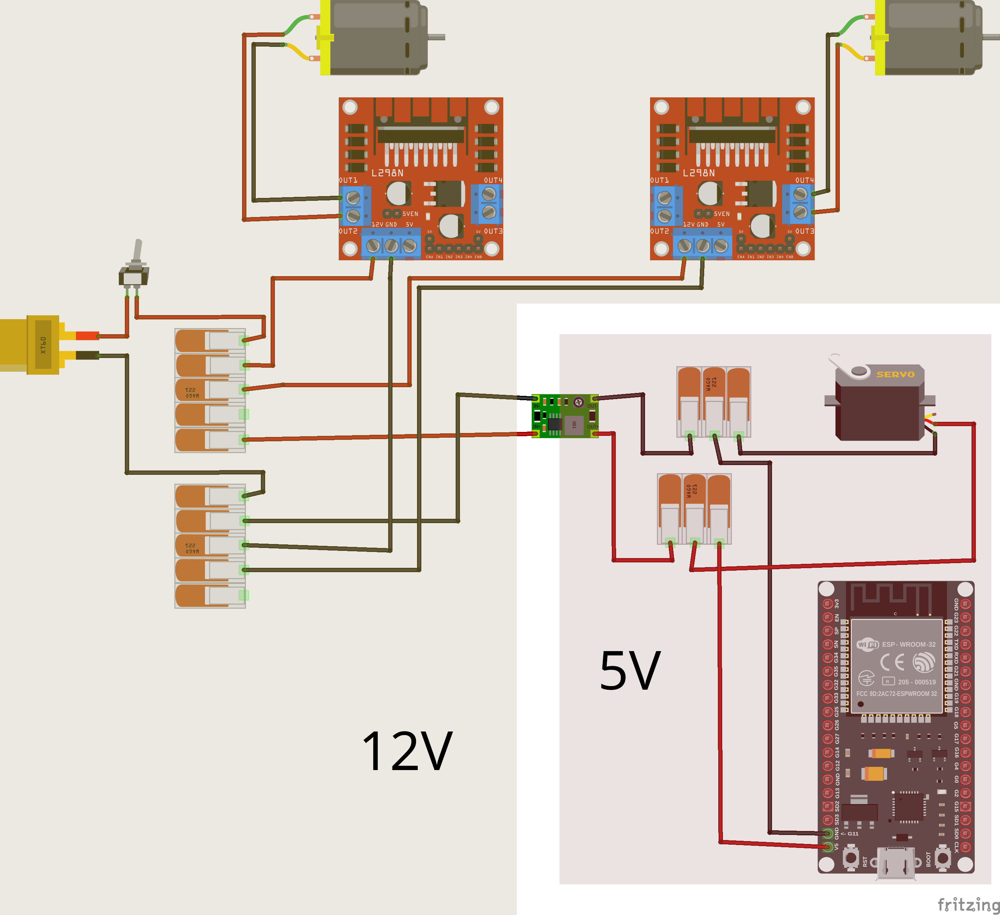
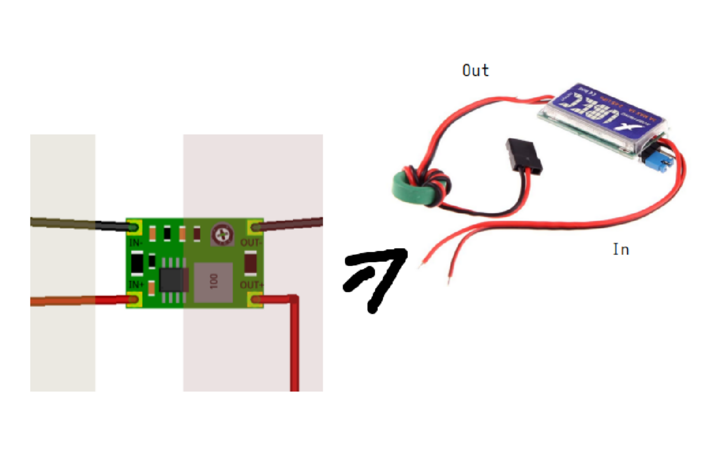
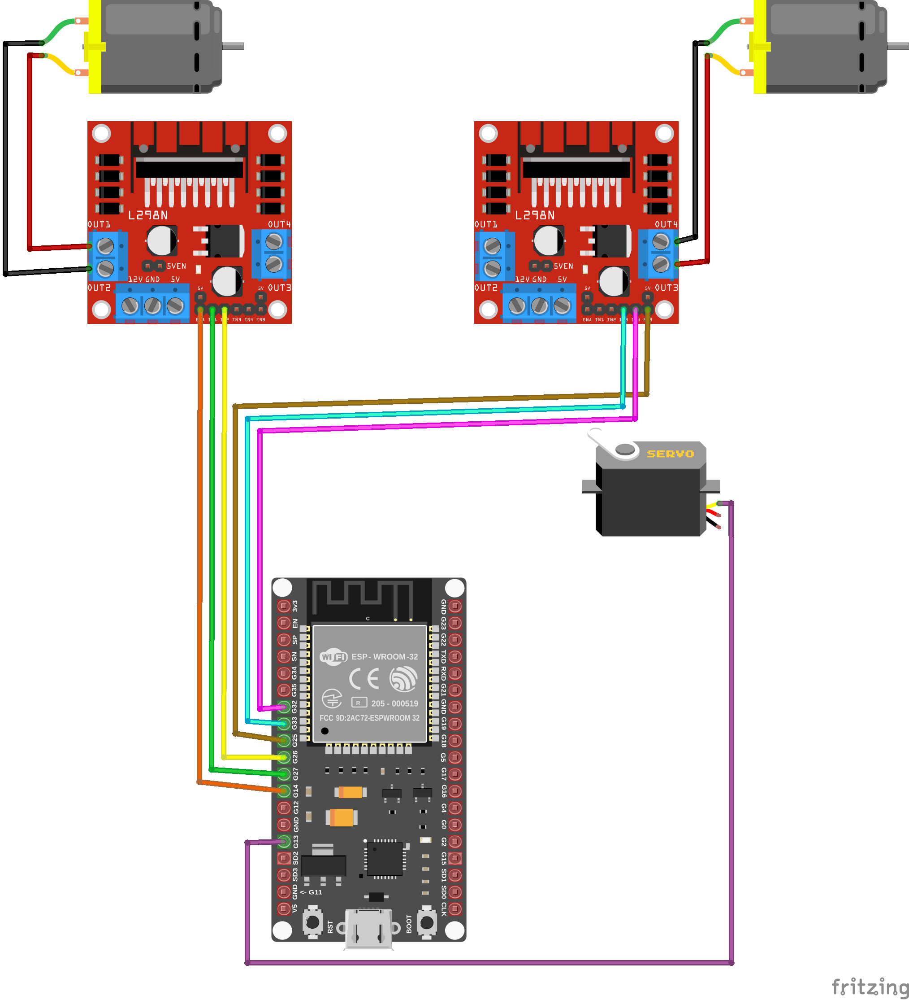
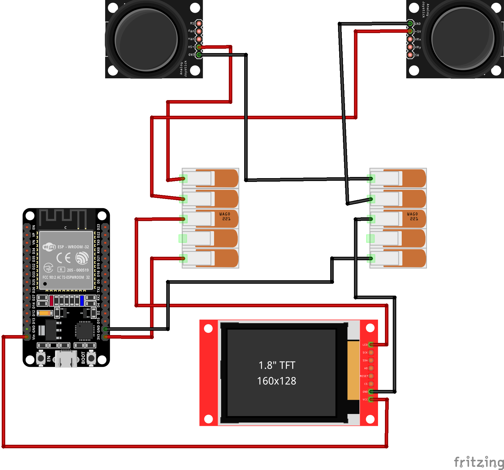
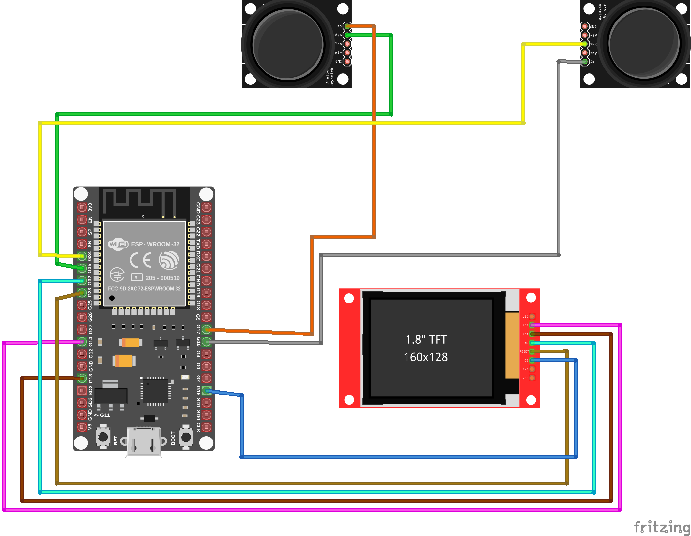
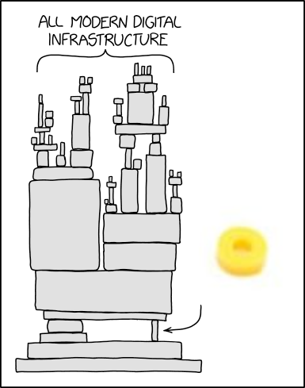
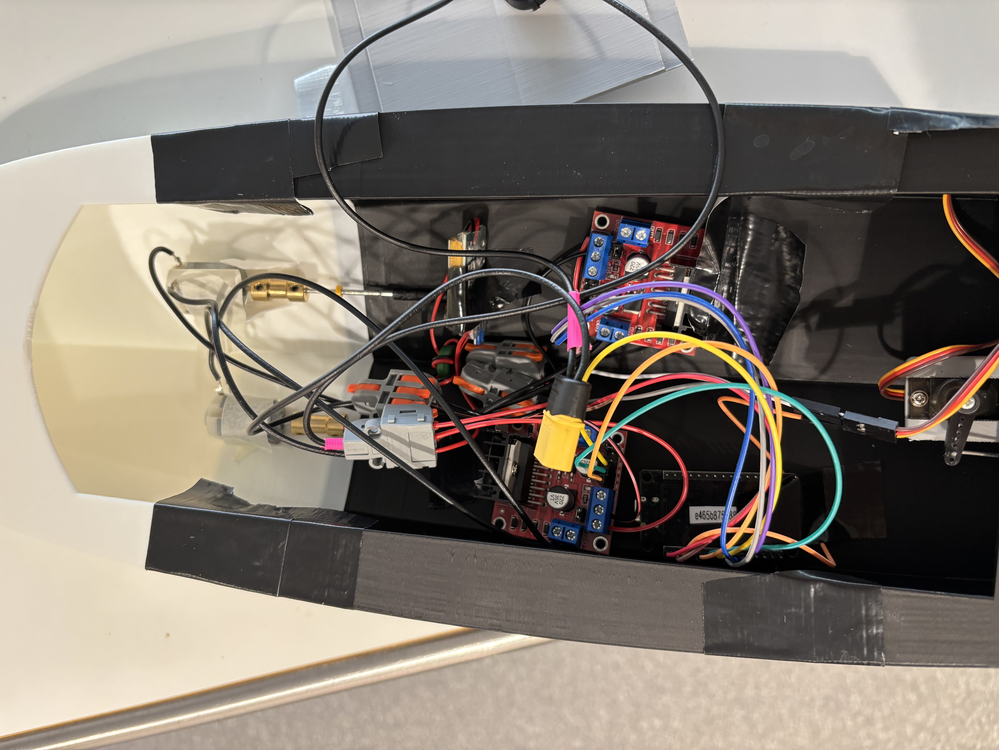

# Motorboot

## Setting Up Arduino IDE and Required Libraries

If you need a quick rundown of the UI, click [here](#arduino-ui-rundown).

In the following sections, I always refer to the versions I have installed and tested.

### Installation

Use the official Arduino guide:
[Download and install Arduino IDE](https://support.arduino.cc/hc/en-us/articles/360019833020-Download-and-install-Arduino-IDE)

### Board Manager

You can find this in your sidebar:

- `esp32` by Espressif Systems (`3.3.0`)

### Libraries

You can find these in your sidebar:

- `TFT_eSPI` by Bodmer (`2.5.43`)
- `ESP32Servo` by Kevin Harrington (`3.0.9`)
- `ezButton` by ArduinoGetStarted (`1.0.6`)
- `RC_ESC` by Eric Nantel (`1.1.0`) (only if using the propeller)

### Configuring TFT_eSPI

This library is a bit unusual. Go to `Arduino/libraries/TFT_eSPI`, where you will find `User_Setup.h`.
There, you need to set specific parameters for the screen. You can find my configuration [here](TFT_eSPI/User_Setup.h).

### Testing and Finding MAC Address

Before assembling anything, the best way to test your Board Manager setup is by running a basic program.
Since we need the MAC addresses of both boards anyway, try flashing this code [here](readMacAdress/readMacAdress.ino).

### Problems with Flashing Code

#TODO

## Arduino UI Rundown

IF YOU KNOW HOW ARDUINO WORKS AND HOW TO FLASH CODE, YOU CAN SKIP THIS.

1. Compiles the code.
2. Compiles and flashes the code to the board selected in 4.
3. Runs the debugger. I have never used it, but I probably should.
4. Selects the board. Click it, then click "Select other board and port...". If no port is discovered, either the cable does not support data, or Arduino does not have permission to access peripherals. Otherwise, select the board used, in our case `ESP32 Dev Module`.
5. idk
6. This is the Serial Monitor. It is basically the standard output you are used to from other languages. Make sure the baud rate is the same as specified in the code `Serial.begin(115200)`, so in our case it is `115200`. The baud rate specifies how many times a signal changes per second between sender and receiver.
7. This contains all your "sketches", which are just folders in your main Arduino folder.
8. Here you can install Board Managers. By default, Arduino IDE supports only Arduino microcontrollers. These are packages that contain pin mappings, clock speed, and other hardware-related information, as well as the specific compiler and uploader needed for your code to work.
9. Here you can install additional libraries. Some are already Arduino Core utilities, like `LittleFS.h` or `WiFi.h`. If a needed library is niche and not officially uploaded, you can download it from GitHub, move it to your `Arduino/libraries` folder, and import it like a normal header file with `#include "something.h"`.
10. Debugger. I have never used it, but I probably should.
11. Sketch-wide search and replace. Since this is a VS Code fork, you might be familiar with it.
12. Preferred way to create new projects. There is also an incredible amount of sample code and examples. Most libraries you download also include examples. It is a great source to start from.
13. If you cannot use your keyboard.
14. I do not know why this exists.
15. Useful lower-level hardware settings. Not really needed for this project except for (2.). The most practical settings are probably the following:
    1. Partition Scheme: memory allocated to the filesystem, the app itself (binary, stack, heap), or space for over-the-air updates. Depending on the project, this might be worth thinking about.
    2. Erase All Flash before Sketch upload: important when you save things to your filesystem and want to preserve it when reflashing the ESP. In our case, the calibration should be preserved.
    3. PSRAM: pseudo-static RAM, which is external RAM mapped to the program's address space and communicated to the CPU through an SPI bus. It is much slower, but needed in certain situations (audio buffer, camera buffer, large JSON).
16. If this does not help much, this is a great source: https://randomnerdtutorials.com/. You can also use the examples in the editor under "File".

## THE BOAT

Boat Components

Controller Components

### General Security Stuff

even if its obvious

- Electronics can behave unpredictably. Never assume a motor is inactive when the battery is plugged in. Make sure the motors are stabilized. This is especially important after flashing the firmware with the correct MAC address.
- Never touch open or uninsulated cables (e.g. the battery switch).
- Always verify the battery charge level before operating the boat. Do not begin a session without confirming sufficient power.

### Quick Rundown

One person will build the controller (Person A), the other one the boat (Person B).

#### MAC Addresses

Both Parallel

- Get MAC addresses of both ESPs (maybe label them).
- Put the MAC address of the other ESP into the code.

#### Electronic Assembly

Person A

- Assemble electronics of controller.
- Test the controls (keep in mind to have the boat off battery).

Person B

- Assemble electronics of boat.

Together

- Tape, or otherwise secure, the motors to the table and test functionality (after controller is tested):
  - throttle and turn
  - if necessary, calibrate

#### Hull and Shell

Person A

- Assemble the electronics in the hull of the controller.
- Build rudder mount.

Person B

- tape motors inside of the boat
- press fit the propellers onto the shaft
- mount shaft onto motor
- put the other electronics into the boat

### MAC Address Configuration

The network protocol we are using broadcasts packets, so we need to specify the receiver.
Flash [this](readMacAdress/readMacAdress.ino) code on both ESPs.

Decide which one is the boat ESP and which one is the controller.
[This](controller/controller.ino) is for the controller and [this](boat/boat.ino) is for the boat ESP. This is where you specify the receiver.

An example output would be `[DEFAULT] ESP32 Board MAC Address: b4:e6:2d:a9:ff:fd`.
In the code meant for the other ESP, find `uint8_t broadcastAddress[]` and insert the respective MAC address, for example `uint8_t broadcastAddress[] = {0xB4, 0xE6, 0x2D, 0xA9, 0xFF, 0xFD}`.

Do that for both ESPs.

Now flash the code on both ESPs and read the serial output.

### Electronics, Some Comments

For connecting the cables, we will mostly be using these cable connectors. Notice that they have a circular opening, but after that there is a smaller square opening where the cables actually connect. If electronics dont light up or seem to power on, the problem is most likely that you missed the square opening or the exposed cable is too short.

In the following, you will get what I call a data diagram and a power diagram. These are just to avoid too many cables in one image.

### Boat Electronics

There is a 12V zone and a 5V zone.
For the 12V zone, use the thick wires.
For the 5V zone, normal wires like jumper wires are fine.

Power

some clarification

Data

If you dont like pinouts, here are the pin specifications.

Servo

- GPIO 13

Motor1

- ENA - GPIO 14
- IN1 - GPIO 27
- IN2 - GPIO 26

Motor2

- ENB - GPIO 25
- IN3 - GPIO 33
- IN4 - GPIO 32

### Controller Electronics

Power

Data

If you dont like pinouts, here are the pin specifications.

Left Joystick (Throttle)

- VRy - GPIO35
- SW - GPIO17
- GND - GND
- 5V+ - 3.3V

Right Joystick (Turn)

- VRx - GPIO34
- SW - GPIO16
- GND - GND
- 5V+ - 3.3V

Display

- GND - GND
- VCC - VIN
- SCL / SCK - GPIO14
- SDA - GPIO13
- RES / RESET - GPIO33
- DC / A0 - GPIO32
- CS - GPIO15
- BLK / LED - 3.3V

### Testing Electronics

Only test electronics when motors are stabilized and no one is too close.

Use tape or the clamps from the laser cutter room to secure components.

Here you can test the [Controls](#controls) to see if everything is working as intended.

Some remarks

- The two propellers are asymmetric and counter-rotating by design: one spins clockwise, the other counter-clockwise when moving forward. This cancels out the torque reaction that would otherwise cause the boat to yaw to one side. To make one spin the other direction by default, you can swap the two wires from the motor to the motor controller.

### Controls

The left joystick is used as the throttle stick by moving it up and down.

The right joystick is used for turning by moving it left and right.

By holding the turn stick, you enter controller calibration. You can cancel it by holding the throttle stick.

(experimental, just dont do it its not fully tested) By holding the throttle stick, you enter boat calibration. You can cancel it by holding the turn stick.

### Assembling the Controller

#### Step 1

Controller Components

#### Step 2

Compress and screw

#### Step 3

Profit

(+) tape it together, press-fit sometimes doesnt really do te press-fitting

### Assembling the Boat

Boat Components

The Boat is a bit more complicated, it involves

- Assembling the whole Rudder part
- Put the boat hull together
- Assemble the Motors and grease the shafts
- lot of tape

#### some disclaimer

This process is not perfectly parallelizable, as you will definetly collide at some point.3

#### Hull

Glue/Tape Hull together

Care that the middle part actually has a correct direction. The wider part should go into the back part of the hull. You can see it well if you look at it from the front (or back respectively).

#### Rudder

##### Step 1

Shaft position

DONT SCREW ALREADY, this is only for you to see that the flat side of the steel shaft should look toward the hole for the screw, so we have more surface area to hold on to

##### Step 2

Add Rudder Mount and Screw the rudder horn to the shaft, use an M3 Screw #TODO

##### Step 3

Mount servo in into the servo mount (grass is green type of instruction). Use the screws from the rudder thingy bag

##### Step 4

Mount servo mount and rudder mount together (yes i am having fun typing this). Use M3 Screw #TODO

#### Motor

##### Step 1

Screw the golden thingy to the motor with the little black screws. make sure that the golden thingy is close enough to the motor, so the whole surface area of the screw is actually holding onto the motor shaft and is tight, but it doesnt have to be too close to the motor. in germany we say "So viel wie nötig, so wenig wie möglich"

##### Step 2

Shaft Tubes

##### Step 3

Before putting the shaft into the tube, grease it thoroughly with this Bootsfett. It’s not about making one huge thick layer (or leaving big blobs in random spots) — it’s about having at least a thin layer everywhere.

The goal is to block water from finding a path into the boat through the shaft tube. To spread the grease evenly, insert the shaft and then turn it while sliding it back and forth until you feel it move smoothly and the grease is distributed along the full length.

Also add these yellow things and push them all way to the rudder tube. trust it will hold the water back.

##### Step 4

Fit all other components. beauty is optional.

#### Finalization

- put the heavy stuff towards the back, especially the battery
- tape everything in place, the motors to the motor holder things, battery, everything. just be careful to not tape the parts on the spots where they get hot
- superglue the shaft TUBES to the boat on the back of the boat. THE TUBES, NOT THE SHAFTS THEMSELVES